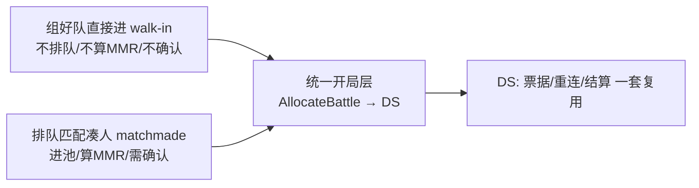

# 决策:进本入口模式——直接进(walk-in)与匹配进(matchmade)分离,统一到开局层

> 决策级别:玩法接入架构(跨 客户端 / matchmaker / ds_allocator)。
> 触发:讨论「PVE 副本是匹配一个队伍就能进,还是不匹配直接进战斗?两种要不要混在一起?大厂标准做法是什么?」
> 日期:2026-07-07。状态:**已拍板——入口分离、开局层合并;PVP 走匹配、PVE 走直接进,配置切换,零新代码**。
> 关联:副本选择链路见 `Pandora-Client-SVN/Doc/服务器/副本选择_UE侧交接_Codex.md`;
> 配表分层见 `docs/design/decision-dungeon-scene-table-layering.md`;
> matchmaker 单写者/分片见 `docs/design/decision-revisit-matchmaker-single-writer.md`。

## 1. 背景与问题

已有 PVP(MobaLevel),现加 PVE 副本(SonglinTown)。map_id 全链路已打通(客户端选副本 →
matchmaker 透传 → ds_allocator 按 map_id 起图/传 label)。剩下的玩法问题:

- 进副本到底是「匹配一个队伍才进」还是「不匹配直接进战斗」?
- 这两种要不要混在同一条链路/同一个撮合池里?
- 大厂标准做法是什么?

## 2. 澄清:服务端现状已有两条路(配置开关)

matchmaker 侧已存在两种成局方式,由 `enable_solo_match` 决定
(见 `services/matchmaking/matchmaker/etc/matchmaker-dev.yaml`):

| 模式 | 配置 | 行为 |
|---|---|---|
| **撮合模式(matchmade)** | `enable_solo_match: false` | 一张票(单人/整队)**不够**开局,要凑满 `2×team_size` 人(A/B 两边对战结构)+ 全员确认(confirm)才拉 DS。这是 PVP 的正路。 |
| **即时开局(walk-in / instant-start)** | `enable_solo_match: true` | 每张票**立即成局、跳过确认、直接 AllocateBattle 拉 DS**。这就是「不匹配直接进」。代码路径为 `formSoloMatch`(biz/match.go)。 |

> 命名债:`enable_solo_match` 注释写的是「本地端到端测试专用」,但其语义本质是「即时开局」。
> 生产 PVE 用它完全合理;后续建议正名为 `instant_start` / `walk_in`,避免「这是测试开关」的误解。

结论:**「直接进副本」不是要新写的功能,代码已存在**,只是当前当 dev 开关用、尚未作为正式 PVE 入口部署。

## 3. 大厂标准做法:入口分离,开局层合并

主流引擎/大厂(Open Match + Agones director 模式、WoW、FF14、Destiny)都是同一结构:

两条**入口**不混池:
- **直接进**:不进撮合池、不算 MMR、不需要 confirm;组好队(或单人)即开局。
  例:WoW 走副本门直接进、Destiny 火力战队直接启动。
- **匹配进**:进撮合池、按 MMR/region 凑人、需要 confirm。
  例:WoW 随机地下城 LFD、Destiny 突袭匹配。

但两条入口**汇到同一开局层**:DS 分配、DSTicket 签发、断线重连、战斗结算全复用一套。
理由:美术做一张地图/一套 DS 流程成本极高,不该为每种入口各写一遍;差异只在「要不要撮合」,
那一层薄薄地分叉即可,下游全共享。

我们当前架构正是这个形状——`ds_allocator.AllocateBattle` 就是统一开局层,matchmaker 只是它的一个调用方;
`enable_solo_match` 就是「入口是否撮合」的分叉开关。

## 4. 拍板结论

**入口分离、开局层合并。** 落到既定「一个 game_mode 一个 matchmaker 部署」的部署模型:

- **PVP 部署**:`enable_solo_match: false`,照旧撮合(凑对手 + confirm)。
- **PVE 部署**:`enable_solo_match: true` + `game_mode: "pve_coop"`,单人/整队带 `map_id`
  **直接开局**,天然避开跨副本混桌。**零新代码,配置即得。**

不要把「直接进」和「匹配进」塞进同一撮合池用条件分支硬切——按 game_mode 分部署,
入口差异用配置开关表达,下游开局层不感知入口类型。

## 5. 明确不做 / 后续增强

- **PVE 匹配补人(matchmade co-op)**:当前**不做**。现有撮合只产出 A/B 两边对战结构,
  没有「3 人队自动补 2 个路人进同一边打怪」的单边成局逻辑。若将来要「路人本」,需给 matchmaker
  加单边(co-op)成局路径。按标准做法**先上「组好队直接进」,补人是后续增强**,不阻塞当前 PVE 落地。
- **`enable_solo_match` 正名**:建议后续改为 `instant_start`(或 `walk_in`)并更新注释,消除「测试专用」误解。

## 6. 待办(落地 PVE 入口)

- [ ] 新增 PVE matchmaker 部署配置(`matchmaker-pve.yaml`:`game_mode: "pve_coop"` + `enable_solo_match: true`)。
- [ ] 客户端 PVE 入口路由到 PVE matchmaker,请求带所选 `map_id`。
- [ ] UE 侧 DS 读 map_id → g_关卡.xlsx → ServerTravel(见 `副本选择_UE侧交接_Codex.md`)。
