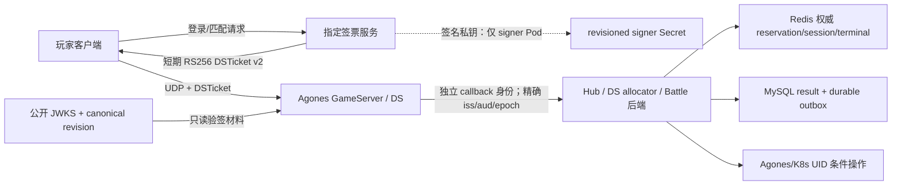

# Model-B 登录、Agones、Hub 与 Battle 修复：Claude Code 只读审核交接

> 日期：2026-07-13  
> 审核对象：当前两个**未提交工作副本**，不是某个已经合并的 commit。  
> Server：`F:\work\XuanMing-Server`  
> UE：`F:\work\Pandora-Client-SVN`  
> 审核方式：只读。请先保存两个工作副本的完整 diff/status，再按本文清单独立反证；不要改代码、不要生成或读取真实 secret、不要把票据或 token 打进日志。

## 1. 结论先行

本轮采用方案 B（Model-B）：玩家拿到短期 DSTicket，DS 使用 revisioned 公共 JWKS 在本地离线验签；DSTicket 签名私钥只在指定签票服务中，绝不进入 Fleet、GameServer、DS 镜像或 DS Pod。DS 调 Hub/Allocator/Battle 后端时使用另一套严格域隔离的 callback 服务身份，它不是玩家 DSTicket，也不能复用玩家票据的 keyset。

普通 stable/canary 镜像发布必须沿用线上当前 DSTicket keyset/revision 和 callback writer epoch，不生成新钥、不换 `kid`、不推进 keyset revision。只有独立、显式、受锁保护的 key rotation 流程才能换钥。因此：

- 若线上已经有有效的 DSTicket signer + 公共 JWKS，普通金丝雀发布**不需要新秘钥**。
- 若目标集群从未 bootstrap 过 Model-B，仍需在首次启用前由受控流程配置一套有效材料；这不是“每次发布都换钥”。
- DS 只持有公开验签材料。所谓“DS 不拿玩家私钥”更准确地说，是 DS 不拿 DSTicket 签名私钥，也不拿可签玩家票据的 HMAC secret。
- 真正线上 K8s/Agones 的玩家 UDP 数据面不依赖本地 UDP relay。relay/端口桥接只解决 Windows + Minikube 本地网络可达性，不能成为线上鉴权或路由设计的一部分。

截至本文最后更新时，代码、单元/契约测试、本地数据库 migration、UE Editor build、Linux DS package、本地 K8s 全量重建以及经过脱敏的登录 gRPC smoke 均已有验证证据；状态和证据边界见第 8、10 节。真实 UE UDP `PreLogin`/Admission/Pawn、实机 logout→relogin 与 Battle terminal E2E 仍未自动化完成。本文只声明**本地 rollout**，不声明 production ready；没有对生产执行 apply、push 或密钥轮换。

## 2. 原始症状与证据边界

用户提供的三段 UE 日志形成了两个连续但相互独立的故障阶段：

1. 登录 RPC 返回 `HTTP 503 without gRPC trailer`，随后登录响应缺少 `hub_ds_addr`；Team、Inventory 等后续 RPC 返回 `HTTP 401`。
2. 路由可达后，登录开始返回一个本地 Hub 地址，网络也能到达 DS，但票据头仍显示旧的 `HS256`；DS 在 `PreLogin` 阶段报 `ticket rejected` 并拒绝玩家。
3. 更早的日志还出现过返回 loopback DS 地址的情况；对位于宿主机/VM 边界之外的客户端而言，服务端返回自己的 loopback 地址不可用。

上述证据支持的直接根因是：

- Envoy 对本地客户端入口的 listener/route 与真实 gRPC 路径不匹配，错误响应没有标准 gRPC trailer，登录链路在网关即失败。
- 登录未成功建立玩家上下文后，客户端仍继续请求 Team/Inventory，因此看到的 401 是前一失败的下游表现，不应通过放宽这些服务的鉴权来“修复”。
- 签票侧仍走 HS256/混合旧桥接，而 DS 已按另一套材料或模式验票，签发与验证契约不一致，故即使 UDP 可达也会在 `PreLogin` 被拒绝。
- 本地回传地址与 Minikube/宿主机网络边界不一致，造成“拿到地址但客户端到不了”的第三类问题。

审核时请区分“原始登录直接根因”和“为安全上线补齐的生产正确性问题”。Hub 容量账本、Admission ACK、Battle terminal outbox、发布门禁并非 503 的直接原因，但不补齐它们，Model-B 即使本地登录成功，也不能安全地做线上金丝雀发布。

本文不保存原始 JWT、DSTicket、callback token、密码摘要或任何 secret 值。审核报告也只能记录算法、revision、claim 形状和摘要，不能复制原始凭据。

## 3. 目标信任模型



### 3.1 玩家 DSTicket 域

- 算法为 RS256 的 DSTicket v2，短 TTL，使用 `kid` 选择 revisioned 公钥。
- DS 只读公共 JWKS，并要求 JWKS 内 revision 是 canonical positive decimal，且与期望 revision 精确一致。
- 票据不只证明“某个 player 被签过”，还必须绑定本次目标 DS 身份与分配生命周期：目标 Pod/GameServer UID、instance epoch、assignment/allocation/release track 等不可被宽松匹配。
- Agones/生产 DS 缺 JWKS、缺 revision、半配置或 revision 漂移时必须 fail closed；不能回退 Scheme-C，也不能偷偷接受 HS256。
- HS256 只允许明确的 local-off 开发路径，并且只能使用开发环境输入或公开的 dev placeholder。只要 Agones 生效或 RS256 required 意图存在，遗留 local-off 配置都不能绕开 RS256。

### 3.2 DS callback 域

- DS 调内部后端使用单独的 `DSCallbackSigner` / `DSCallbackVerifier` 窄接口。
- callback 身份使用精确 issuer `pandora-ds-control`、audience `pandora-ds`，并受 writer epoch/keyset revision/fence 约束。
- callback HMAC/keyset 不能与玩家票据 keyset 有交集；玩家 token、DSTicket 或普通客户端 JWT 不能冒充 DS callback。
- callback 材料可以由目标 DS 使用，因为它只授权受限的内部回调；它不能签发玩家 DSTicket。审核时必须验证 scope/路由仍是最小权限，而不是仅凭“在内网”放行。

### 3.3 金丝雀与换钥是两条操作轴

- 普通发布只替换业务镜像/副本，不改变 DSTicket revision、active `kid`、接受公钥集合或 callback writer epoch。
- stable 与 canary 必须同时验证同一线上 revision；旧 Allocated DS 可继续完成已有会话，新 revision Ready 池才接新玩家。
- 换钥只能走显式 stage → promote → retire 流程，并覆盖最长 DSTicket TTL、clock leeway 和 retire buffer；不能借 ordinary canary 顺手轮换。
- callback writer epoch 的推进属于 DS auth activation/fencing，不属于普通镜像金丝雀，也不能与 DSTicket revision 混成一个数字。

## 4. 按子系统的实现改动

### 4.1 Envoy、服务路由与 mesh

重点入口：

- `deploy/envoy/envoy.yaml`
- `deploy/k8s/agones/16-ds-envoy.yaml`
- `deploy/k8s/overlays/online/inventory-mesh/`
- `deploy/k8s/overlays/online/ds-terminal-mesh/`
- `deploy/k8s/overlays/online/mesh-shared-identity/`
- `deploy/k8s/overlays/online/netpol.yaml`

已修正本地客户端和 DS listener/route，使登录请求进入正确的 gRPC cluster，不再以无 trailer 的 503 结束。Inventory 的内部 RPC 路由被收回到内部 mesh/mTLS 通道，不通过放宽玩家入口解决 401。online overlay 增加内部调用的身份和网络边界；请审核 PeerAuthentication、AuthorizationPolicy、Service/port 命名及 sidecar interception 是否在目标 Istio revision 下得到预期语义。

需重点反证：一个空/拼错的 policy selector、source principal 或 port 是否会意外扩大到全 namespace；DS 终态回收和 Inventory 内部 RPC 是否能被普通客户端 listener 调用；健康检查是否在 STRICT mTLS 下仍可工作。

### 4.2 DSTicket 签发、验签与配置

Server 重点入口：

- `pkg/auth/domains.go`
- `pkg/config/config.go`
- `services/matchmaking/matchmaker/cmd/matchmaker/main.go`
- `services/matchmaking/matchmaker/internal/conf/conf.go`
- `tools/scripts/dsticket_keyset.ps1`
- `tools/scripts/dsticket_rotate.ps1`
- `tools/scripts/lib/dsticket_rotation_contract.ps1`
- `deploy/k8s/services/services.yaml`
- `deploy/k8s/agones/20-fleet-battle.yaml`
- `deploy/k8s/agones/21-fleet-battle-canary.yaml`
- `deploy/k8s/agones/30-fleet-hub.yaml`
- `deploy/k8s/agones/31-fleet-hub-canary.yaml`

Matchmaker 的 real allocator 现在没有 v2 signer 就拒绝启动，不再回退 HS256。四个签票角色的私钥引用与 Login/DS 的公共 JWKS 引用按 revision 固定，Fleet 只允许挂公共 JWKS。部署契约会拒绝 DS 中的 signer Secret、私钥形状、玩家 HS secret，以及 revision 不一致/半配置。

UE 重点入口：

- `Pandora/Source/Pandora/Private/Auth/PandoraDSTicket.cpp`
- `Pandora/Source/Pandora/Public/Auth/PandoraDSTicket.h`
- `Pandora/Source/Pandora/Private/Gameplay/Default/PandoraDSGameModeBase.cpp`
- `Pandora/Source/Pandora/Private/Net/PandoraAgonesSubsystem.cpp`
- `Pandora/Source/Pandora/Private/Auth/PandoraDSTicketV2Test.cpp`

UE 验票策略已经朝以下 fail-closed 规则收敛：存在 JWKS 或 revision 任一配置即表示 RS256 意图；只配一半必须拒绝。真实 Agones 或任意非空 `PANDORA_DSTICKET_RS256_REQUIRED` 也强制 RS256，即使两个 keyset 环境变量都缺失。非 local-off 路径拒绝玩家 HS secret；DS Ready 不能建立在遗留 HS 配置上。

Claude 必须针对最终 UE diff 再确认：所有 `PreLogin` / `InitNewPlayer` 分支都先执行 v2 精确验签；任何配置默认值、Blueprint 属性、INI 或旧 `TicketSecret` 都不能让生产 DS 回退；错误日志不得输出完整连接 URL 或票据。

### 4.3 DS callback auth 与不可回退 fence

重点入口：

- `pkg/middleware/dsauth.go`
- `pkg/dsauthfence/activate.go`
- `pkg/dsauthfence/etcd.go`
- `pkg/dsauthfence/fence.go`
- `pkg/dsauthfence/security.go`
- `pkg/dsauthfence/cmd/dsauth-activate/main.go`
- `pkg/dsauthfence/cmd/dsauth-required/main.go`
- `tools/scripts/activate_ds_auth.ps1`

实现将 callback 身份与玩家鉴权域分离，并为受保护 writer 引入不可回退 activation/fence。activation 不只看一个可删除的 current key，而是结合 genesis/history、目标 epoch、keyset revision 和 etcd identity revision 做事务/CAS 校验；一旦安全模式被激活，删除 current 状态不能把集群恢复到 legacy epoch。

生产 activation 还要求自定义 CA/mTLS/ACL 最小权限和负向读测试：业务 writer 只能读自己需要的 required/fence 范围，不能因共享默认 identity 获得整个 etcd 前缀。请 Claude 逐条追踪五类受保护 writer 的 Deployment、ServiceAccount、证书 identity、配置和 middleware，确认没有遗漏旁路 RPC 或 legacy writer。

### 4.4 Hub 权威 reservation/session ledger

重点入口：

- `services/battle/hub_allocator/internal/data/hub_capacity_ledger.go`
- `services/battle/hub_allocator/internal/data/hub_authoritative.go`
- `services/battle/hub_allocator/internal/data/hub_repo.go`
- `services/battle/hub_allocator/internal/biz/hub.go`
- `services/battle/hub_allocator/internal/service/hub.go`
- `proto/pandora/hub/v1/allocator.proto`

核心修复：

- Redis 使用带相同 hash tag 的 HASH + ZSET，reservation 保存绝对过期时刻；active session 不依赖短 TTL 自动消失。
- 可分配容量由 `reservations + sessions` 决定。DS heartbeat 只提供审计/观测，不能用一个心跳人数覆盖或删除权威 seat ownership。
- assignment、GameServer UID、instance epoch、writer epoch 与 admission sequence 必须精确匹配。较小 seq 冲突、相同 seq 幂等、较大 seq 才能按契约推进。
- DS admission ACK 将 reservation 原子转换为 session；玩家 departure 才精确释放对应 session。失败、超时、响应丢失和重试不能多扣/多还座位。
- 已有 assignment 的登录不能直接重签票后跳过容量账本：active session 可复用；reservation 过期或玩家已正常 departure 时，必须原子重建新 reservation；CAS loser 不能删除赢家的 seat。
- MaxPlayers 已在 UE、Fleet、allocator 环境和启动 map URL 统一为 500，避免 DS 实际 16、控制面 500 的假容量。

主要回归场景包括 clean departure → relogin、expired reservation → relogin、active session reuse、并发同玩家、seq 重放、签票失败补偿、UID/epoch 漂移和容量边界。

### 4.5 Hub Admission ACK 与 Pawn 生成门

UE 重点入口：

- `Pandora/Source/Pandora/Private/Gameplay/Default/PandoraHubGameMode.cpp`
- `Pandora/Source/Pandora/Public/Gameplay/Default/PandoraHubGameMode.h`
- `Pandora/Source/Pandora/Private/Net/PandoraDSBackendSubsystem.cpp`
- `Pandora/Source/Pandora/Public/Net/PandoraDSBackendSubsystem.h`

目标不变量是：DSTicket 通过 `PreLogin` 只是“身份和目标 DS 合法”，玩家必须在 Hub 后端精确 ACK reservation→session 之后才能生成可玩 Pawn、写 HUB locator 或进入玩法。当前实现先设置 admission gate，再调用基类 `PostLogin`；pending 状态缺失、ACK 拒绝、超时耗尽都保持 gate 并踢出。成功 ACK 才打开 gate 并补做 starting flow。departure 使用同一 assignment/UID/epoch/seq 身份，未知响应进入有界重试队列。

Claude 必须专门做一个绕过审查：不能只看 `HandleStartingNewPlayer` 和 `RestartPlayer`。请搜索 Blueprint/C++ 是否能直接调用 `SpawnDefaultPawnAtTransform`、`SpawnDefaultPawnFor` 或其它生成路径，并确认最终类在 admission 未 ACK、pending 缺失或受保护 identity 状态异常时机械返回空；只有 ACK success 能进入 `Super`。这项结论必须以最终 UE 源码和 Automation mutant 为准，不能只依据本文。

### 4.6 Battle result 与终态释放 outbox

重点入口：

- `services/battle/battle_result/internal/data/battle_repo.go`
- `services/battle/battle_result/internal/data/terminal_release_schema.go`
- `services/battle/battle_result/internal/data/terminal_releaser.go`
- `services/battle/battle_result/internal/biz/battle_result.go`
- `services/battle/ds_allocator/internal/biz/allocator.go`
- `services/battle/ds_allocator/internal/data/battle_auth.go`
- `proto/pandora/ds/v1/allocator.proto`

旧问题是跨 MySQL、Redis 和 K8s 的“结果已提交但 DS release 未完成”窗口。callback token 到期、RPC 成功但响应丢失、进程重启或 DB ACK 失败都可能让 GameServer 永久残留，或让重试误删新实例。

新流程：

1. Battle result 与 terminal release proof/outbox 在同一个 MySQL 事务中提交。
2. 到达通知宽限窗后，phase 1 以 `completed` proof 调 ds_allocator：先做 Redis terminal/receipt 幂等 CAS，再以 GameServer UID precondition 执行 K8s 删除/释放；外部结果未知时保留永久 terminal 和原始 outbox 重试。
3. phase 1 明确成功后，MySQL 以 `released_at_ms = 0` 条件 CAS 写 durable ACK。
4. phase 2 用 `completed-finalize` 对同一 proof 恢复有限 TTL；该 reason 绝不能再次调用 K8s。
5. 只有 phase 2 明确成功，才删除 `released_at_ms > 0` 的 outbox 行。

持久 proof 只保存 callback token 的 SHA-256 等验证字段，不保存原始 token。Claude 应验证每次重试都绑定同一 match/allocation/pod/UID/epoch/auth generation/JTI/writer epoch，且 UID 漂移、proof 变形、先 finalize、重复 release、DB CAS 失败和响应丢失都 fail closed 或保持可恢复。

### 4.7 发布激活、镜像与 Service 切换门禁

重点入口：

- `tools/scripts/start.ps1`
- `tools/scripts/lib/online_manifest_contract.ps1`
- `deploy/k8s/overlays/online/kustomization.yaml`

online 激活增加了以下防线：

- Service 切 stable/canary 时使用 RFC6902 `test resourceVersion`，并整体替换精确 selector `{app,set,epoch}`，避免只 patch 一个 label 后留下旧选择器。
- `ExpectedDigests` 是逐服务精确映射；即使两个镜像都合法，也不能把 A 服务 digest 交换给 B 服务。
- EndpointSlice 必须核对 controller/owner、Pod name/UID/IP/port/readiness、精确 UID 集合并拒绝重复，不能只看 endpoints 数量。
- synthetic Job 固定 image digest、ServiceAccount、command/args/env、单容器、无 sidecar/init/host/mount/envFrom、禁用 token，并严格解析带时间戳的结果；任一 admission 注入或规格漂移都阻断。
- mTLS/etcd identity revision 与负向 forbidden-read 证据是激活条件，不能用“内网可达”代替身份验证。
- ordinary release 读取并锁定 live DSTicket 状态，发布前、锁内和结束前复验；不得借发布修改 keyset 或 callback epoch。

本地启动还修复了 Minikube profile 选择：`Sync-ImagesToMinikube` 显式接收 `-p pandora-agones`，避免业务镜像被加载到另一个当前 profile。本项只消除本地误投，不代表已完成新 DS package 或集群重建。

## 5. 安全与一致性不变量

Claude 审核最终 diff 时，应把下列条目当作必须全部成立的完成定义：

1. Fleet/DS 中只有公共 JWKS；无 DSTicket 私钥、玩家 HS secret、signer Secret、可疑 CSI/projected/env/envFrom 旁路。
2. Login/Matchmaker/Hub 等 signer 只能取得自己需要的 revisioned private material；日志、错误和 Pod annotation 不泄露材料内容。
3. 生产/Agones DS 只接受 RS256 v2；缺配置、半配置、revision 非 canonical/不一致、未知 `kid`、错误 alg 都拒绝，绝不回退。
4. DSTicket 精确绑定目标 DS 和分配生命周期；换 Pod 名、UID、epoch、assignment、allocation 或 release track 不能复用。
5. 玩家票据域与 DS callback 域在 keyset、issuer、audience、接口和 middleware 上均隔离；客户端 token 不能调用内部 writer。
6. ordinary canary 不换 DSTicket keyset/revision/active `kid`，也不推进 callback writer epoch。
7. Hub 容量只由权威 reservation/session ledger 决定；heartbeat 不拥有删除权；总座位永不超过 MaxPlayers。
8. reservation→session、departure、relogin 和 CAS loser 路径不会丢 seat、双占 seat 或释放别人的 seat。
9. Hub admission ACK 前没有可玩 Pawn，没有 HUB locator；失败/未知路径不会短暂打开 gate。
10. Battle result、terminal proof 和 outbox 同事务；外部 release 未明确完成时不丢 durable intent。
11. K8s release 使用 UID precondition；旧 proof 不能删掉同名新 GameServer；finalize-only 永不碰 K8s。
12. Service 激活同时绑定 immutable per-service digest、精确 EndpointSlice/Pod 身份和 resourceVersion；synthetic evidence 不能被伪造规格冒充。
13. 所有失败路径日志只记录非敏感 ID/摘要/错误分类，不输出连接 URL 中的完整票据、原始 JWT/callback token 或 secret。

## 6. 数据库迁移

迁移文件：

- `tools/migrate/migrations/pandora_battle/000002_terminal_release_outbox.up.sql`
- `tools/migrate/migrations/pandora_battle/000002_terminal_release_outbox.down.sql`
- 开发初始化镜像同步定义：`deploy/mysql-init/05-battle-outbox.sql`

`up` 以 additive-only 方式创建 InnoDB 表 `terminal_release_outbox`。表包含 16 列，唯一约束 `match_id`，以及按 `release_after_ms,id` 扫描的 due index；proof 身份列使用 ASCII binary collation，避免大小写/排序宽松匹配。新 `battle_result` 在 authority mode 启动前会通过 `information_schema` 精确核对 engine、collation、所有列顺序/类型/default/extra 和四条 index row；半迁移实例不能先注册 capability。

本轮已经在**本地** `pandora-agones` 环境使用 `tools/migrate` 正式 runner 执行 migration，观察到 `pandora_battle.schema_migrations` 为 version 2、dirty 0，并核对 16 列/预期索引。临时 DSN/target 文件和 port-forward 已清理。此证据不等于生产 migration；生产必须先由独立 migration Job 执行并留存 schema gate 结果，再允许新 `battle_result` 接流量。

回滚不是正常金丝雀路径：一旦新版本写入未释放 outbox，直接 drop 表会丢 durable release intent。Claude 应确认 down migration 只用于明确停机/清空后的人工恢复流程，发布脚本不会自动执行 down。

## 7. 已完成的验证证据

以下结果来自当前 Server 工作副本；Claude 应独立重跑并保存命令、退出码和失败反例名称：

- `go.work` 中全部 module 分别执行 `go test <module>/... -count=1`：PASS。仓库根没有 `go.mod`，不要把根目录 `go test ./...` 的 workspace pattern 错误当业务失败或成功。
- `tools/migrate` 在 `GOWORK=off -mod=readonly` 下测试：PASS。
- 变更相关 module 的 `go vet`：PASS，包括 `pkg`、`pkg/dsauthfence`、`proto`、`login`、`matchmaker`、`ds_allocator`、`hub_allocator`、`battle_result`、`tools/migrate`。
- Battle MySQL 8.4 integration：PASS；覆盖并发、成功但响应丢失、DB failure、TTL/finalize、rotation/identity 和 UID drift 等路径。
- Hub Model-B/ledger 回归：PASS；包括 clean departure→relogin、expired reservation→relogin、active session reuse 和 CAS/容量反例。
- 12 个 PowerShell 契约脚本逐个运行：PASS：
  - `tools/scripts/tests/ds_auth_activation_contract_test.ps1`
  - `tools/scripts/tests/ds_entrypoint_log_redaction_contract_test.ps1`
  - `tools/scripts/tests/ds_terminal_mesh_contract_test.ps1`
  - `tools/scripts/tests/dsticket_keyset_contract_test.ps1`
  - `tools/scripts/tests/dsticket_rotation_contract_test.ps1`
  - `tools/scripts/tests/envoy_inventory_internal_rpc_contract_test.ps1`
  - `tools/scripts/tests/gen_cluster_b1_contract_test.ps1`
  - `tools/scripts/tests/infra_etcd_persistence_contract_test.ps1`
  - `tools/scripts/tests/inventory_mesh_contract_test.ps1`
  - `tools/scripts/tests/local_k8s_profile_contract_test.ps1`
  - `tools/scripts/tests/online_manifest_contract_test.ps1`
  - `tools/scripts/tests/services_dsticket_secret_contract_test.ps1`
- `git diff --check`：PASS，仅有工作副本既有 CRLF/LF 提示。
- 独立只读生产代码审计未发现剩余 P0/P1；留下的 P2 是实集群语义验证，不应伪装成已完成。

边界：Go race suite 因当前环境 `CGO=0` 未运行；不能用普通并发单测替代最终 race/压力验证。UE build/Automation、本地 K8s rollout 与登录 smoke 的独立证据列在第 8、10 节；真实 UE UDP 生命周期不在上述 PASS 内。

## 8. 当前本地集群实测结果

本轮只改写本地 `pandora-agones` Minikube 与本地测试数据库；执行前确认 `kubectl current-context`、active Minikube profile 和 API server 均指向 `pandora-agones`，且没有 Allocated GameServer。生产集群未连接、未写入。

### 8.1 Linux DS 与本地 rollout

- UE 5.8 source engine 的 Linux BuildCookRun 成功：1278/1278 actions，`BuildCookRun time: 1192.51 s`，`BUILD SUCCESSFUL`，ExitCode 0。
- 新 archive：`F:\work\Pandora-Client-SVN\PandoraDSArchive-local-20260713-140049\LinuxServer`；明确通过 `PANDORA_DS_LINUX_PKG` 传给本地构建，没有回退到旧 sibling package。
- archive 与 `F:\work\XuanMing-Server\deploy\ds\stage\LinuxServer` 均为 39 个文件、1,153,366,974 bytes；两处 `PandoraServer` SHA-256 都是 `E458DA9471087DD799B08240288ADD02059CEC9BAE323CCAA20C51CA3F5EF4D6`。
- `start.ps1 -Mode k8s -AdvertiseHost 127.0.0.1 -Rebuild -BuildMode host` 完成 20 个 Go service image 的重新构建，并逐个使用 `minikube -p pandora-agones image load --overwrite=true` 加载；20 个业务 Deployment 全部 available，20 个 gRPC health check 均为 SERVING。
- Agones Fleet 位于 `default` namespace，业务服务位于 `pandora` namespace。最终状态：battle stable desired/current/ready 2/2/2，hub stable 1/1/1；两个 canary desired 0；allocated 0。三个 DS Pod 均 Running/Ready、0 restart。
- 运行中 Hub DS 容器 imageID 为 `docker://sha256:0bf8f338af801dff8ec3ee79360c1baebd681f2575d54be31032a167b9d21493`；容器内二进制 SHA-256 与上述 archive 完全一致。
- Hub DS 的 `MaxPlayers=500` 同时出现在 Fleet env 与 UE 启动 URL；keyset revision 为 1，只挂载 public JWKS。对该 DS 容器的 env 名称扫描没有发现 player ticket private key、HMAC 或 JWT secret。`release_track=stable` 来自 Agones Fleet/GameServer/Pod 的受保护 label/annotation，不是 DS 自报的环境变量。
- 本地 Battle migration 已为 version 2、dirty 0；terminal outbox 为 16 columns、4 indexes，`battle-result` 启动 schema dependency gate 为 ready。

第一次 `start.ps1` 在最后重建宿主机 Envoy 时暴露了 Docker Desktop 旧 listener 延迟释放竞态；它发生在 K8s rollout 与全部 health check 完成之后。桥接脚本现已修复：先按 container ID 读取并精确校验 `com.docker.compose.service=envoy` 与规范化后的当前 `project.config_files`，只停止属于本 checkout 的 Envoy，再确认 8443/8444/9901 全部释放后 force-recreate；不杀 Docker backend，也不猜测性停止其它 checkout/容器。加固版契约测试 PASS，真实桥接重跑 ExitCode 0，20 个 upstream 再次全部 SERVING，开启 CA 校验的 TLS/gRPC reflection PASS。当前 `pandora-envoy` 与 `pandora-udp-relay` 均 Running，relay 绑定 `127.0.0.1:7000-8000/udp`；本地 relay 不能带到线上。

本轮实际使用的本地命令为：

```powershell
$env:PANDORA_DS_LINUX_PKG = 'F:\work\Pandora-Client-SVN\PandoraDSArchive-local-20260713-140049\LinuxServer'
pwsh tools/scripts/start.ps1 -Mode k8s -AdvertiseHost 127.0.0.1 -Rebuild -BuildMode host
```

该命令只适用于本地 `pandora-agones`，不能复制到 online/production。

### 8.2 脱敏登录 smoke

通过 mkcert CA 校验 TLS、authority=`localhost` 且**没有**使用 `-insecure`，经 `127.0.0.1:8443` 调用 Login。使用新建的本地 smoke 账号；原始登录响应、session JWT 和 DSTicket 仅存在于测试进程内存，未写文件、未回显。结果：

- Login 返回 `code=OK`、player id 与 Hub 地址 `127.0.0.1:7183`。这里的 loopback 是本轮显式 `-AdvertiseHost 127.0.0.1` 的同宿主机本地配置；线上必须返回 Agones/公网网络方案的真实玩家地址。
- DSTicket header/claims 摘要为 `alg=RS256`、`dst_ver=2`、TTL 120 秒、`iss=pandora-dsticket`、`aud=pandora-game-ds`、`release_track=stable`、keyset revision 1。
- 使用 DS 同款 public JWKS 独立执行 RSA PKCS#1 v1.5 / SHA-256 验签成功；active `kid` 匹配。
- 票据中的 Hub Pod、GameServer UID、DS instance epoch、assignment id 与 live GameServer/Redis reservation 精确匹配；签发时 GameServer 为 Ready。
- 签发后精确 reservation 存在、session 不存在；超过本地 reservation TTL 后，对应 reservation/expiry key 已自动清理，当前无遗留座位。
- Login 日志记录 `login_ok`；业务 namespace 当前 0 个异常 Pod。日志中没有本次请求的 503、401 或 ticket rejection。

这条 smoke 证明的是 TLS → Envoy → Login → Hub allocator → Redis reservation → RS256 v2 签票/验签与目标绑定；它**没有**驱动 UE UDP，因此不能证明 `PreLogin`、Admission ACK、Pawn gate、实机 logout→relogin 或 Battle terminal 生命周期。

## 9. 生产未执行事项与外部前置

本轮没有：

- 对生产 namespace 执行 `kubectl apply/patch/delete`；
- build/push 生产 registry 镜像；
- 创建、替换或轮换生产 DSTicket/callback secret；
- 推进生产 DSTicket revision、active `kid` 或 callback writer epoch；
- 切换生产 Service selector；
- commit、push 或创建 PR。

生产发布前必须由操作者提供并验证：

1. 已存在且连续的 revisioned DSTicket signer Secret 与公共 JWKS ConfigMap/外部 secret-store 投影；DS 只能看 public 部分。若是首次 bootstrap，走专用 bootstrap，不走 ordinary release。
2. callback keyset 与玩家 keyset 无交集；etcd custom CA、mTLS client identity、ACL 和当前 identity revision 已配置，负向 forbidden-read 真正失败。
3. 目标 Istio control plane/revision、STRICT mTLS、AuthorizationPolicy、CNI/admission 行为已在真实 API server 上验证。
4. 每个服务的 immutable registry digest、目标平台 manifest 和 CRI `imageID` 语义已验证，尤其是 multi-arch index digest 与节点拉取后的 platform digest 映射。
5. 新 Battle migration Job 先完成，schema exact gate PASS；备份/恢复方案不会删除未完成 terminal outbox。
6. synthetic Job 在真实生产 API/CNI/admission 下运行，并将观察到的规范与结果 JSON 回灌审核；静态构造的 Job 不能替代 live evidence。
7. Agones Fleet、GameServerSet、Pod、EndpointSlice owner/UID 链真实一致；旧 Allocated DS 只排空，不强杀。
8. 生产玩家 UDP 地址由 Agones/LoadBalancer/公网网络方案返回；不得部署本地 Minikube UDP relay 作为线上依赖。
9. 监控至少覆盖登录 gRPC code、ticket reject 分类、Hub reservation/session 计数、admission latency/冲突、departure retry、terminal outbox backlog/age、UID-precondition failure 和 canary/stable 分布。

## 10. 主线程收尾状态

| 项目 | 当前状态 | 实际证据与边界 |
|---|---|---|
| UE Editor/UHT 全量 build | **PASS** | UE 5.8，715/715，Result Succeeded，841.99 秒；`F:\work\Pandora-Client-SVN\Pandora\Saved\Logs\CodexHubEditorBuild6.out.log` |
| UE no-op closure build | **未独立完成** | full build 后尝试 no-op/module closure 时 UBT 展开为 552 actions，因 Linux 目标已作为发布制品验证而停止；不能把它记作 no-op PASS |
| UE Automation | **PASS（有测试源码尾差说明）** | `Pandora.Auth.DSTicketV2` 5/5、整个 `Pandora.Net` 12/12，共 17/17。日志：`CodexHubAutomationDSTicketV2.log`、`CodexHubAutomationPandoraNet.log`。其后只给 DSTicket 测试补了 reason-specific assertion，独立只读审计未见语法/逻辑问题，但这份最后的**测试断言改动**未重新编译/执行；生产代码和 Linux package 不受该尾差影响 |
| `PandoraServer` Win64 Development | **N/A（未完成）** | Win64 Server 构建主动停止，由实际部署目标 Linux BuildCookRun 取代；不宣称 Win64 PASS |
| `PandoraServer` Linux Development/package | **PASS** | source engine + Clang，1278/1278，BuildCookRun 1192.51 秒，ExitCode 0；archive/stage 各 39 文件、1,153,366,974 bytes；二进制 SHA-256 `E458...F4D6`；日志 `F:\work\Pandora-Client-SVN\Pandora\Saved\Logs\CodexHubLinuxDSBuildCookRun.out.log` |
| 本地 20 个 Go 服务 + DS image rebuild/load | **PASS** | 20 个 Go image 构建并显式 load 到 `pandora-agones`；20 个 Deployment 新 Pod 0 restart 且 gRPC SERVING；运行中 DS 二进制哈希与 fresh archive 一致 |
| 本地 K8s full rollout | **PASS** | battle stable 2/2 Ready、hub stable 1/1 Ready、canary 0、allocated 0、DS 0 restart；首次运行暴露的 8443 listener 释放竞态已在 `k8s_envoy_bridge.ps1` 修复，等待 8443/8444/9901 且精确校验容器归属；真实重跑 ExitCode 0，Envoy/relay Running，TLS/gRPC reflection PASS |
| 登录 gRPC smoke | **PASS** | TLS 校验开启；Login OK；RS256/v2/revision 1；public JWKS 验签和 Pod/UID/epoch/assignment/track/Redis reservation 精确匹配；未记录 raw token。地址为本地同宿主机有意配置的 `127.0.0.1:7183`，不是线上地址模板 |
| 真实 UE→Hub UDP/PreLogin | **待实机** | 没有安全的无头 UE 驱动器；未用命令行传 DSTicket，以免凭据进入进程列表/日志。必须由客户端正常 Login→SelectRole→ClientTravel 验证 `PreLogin`、ACK 后 Pawn |
| logout→relogin/过期 reservation | **部分 PASS** | 单元回归覆盖 clean departure、expired reservation、active session reuse；live smoke 的未入服 reservation 已在 TTL 后自动清理。真实 UE logout→relogin 仍待实机 |
| Battle terminal E2E | **部分 PASS** | MySQL 8.4 integration、migration、schema exact gate 均 PASS；没有真实 UE 战局驱动，因此 result→phase1→durable ACK→finalize→GameServer UID 条件回收的 live 全链路仍待实机 |

如果自动化只能验证登录 gRPC 而不能驱动 UE UDP，最终报告必须明确保留“真实 UE E2E 未完成”，不能用 `grpcurl` 登录成功替代 `PreLogin`/Admission/Pawn 验收。

## 11. Claude Code 只读审核清单

### A. 审核准备

- [ ] 分别捕获 Server 的 `git status/diff` 与 UE 工作副本的实际 SCM status/diff；不要只看 HEAD。
- [ ] 确认本文是导航，不是证据；所有结论回到最终源码、测试和 live object。
- [ ] 不运行会写 registry/K8s/DB/secret-store 的命令；不打开或回显真实 secret/token。
- [ ] 校验 proto 源与 checked-in Go/C++ generated files 同步，unknown fields/字段号保持滚动兼容。

### B. 登录与 Model-B

- [ ] 从 Envoy 8443 listener 一直追到 Login gRPC handler，确认 route/cluster/protocol 和 trailer 正常。
- [ ] 追踪四类 signer 的私钥挂载，证明 Fleet/DS 无任何签名材料；扫描 Secret、CSI、projected、env、envFrom、init/ephemeral container。
- [ ] 构造缺 JWKS、缺 revision、revision 0/前导零/溢出、unknown `kid`、alg confusion、HS256、错 Pod/UID/epoch/assignment/allocation 的反例，全部拒绝。
- [ ] 确认 Scheme-C/online authority 和 local-off 不会在真实 Agones 下成为 v2 fail-open fallback。
- [ ] 确认普通 stable/canary 对 keyset/revision/active `kid`/callback epoch 只读且前后复验；换钥只能走专用 rotation。

### C. callback、Hub 与 UE admission

- [ ] 玩家 JWT/DSTicket/callback token 三类凭据交叉投递，全部被错误 audience/issuer/domain 拒绝。
- [ ] etcd genesis/history/fence 删除、回退、并发 activation、错误 identity revision 和越权读取都 fail closed。
- [ ] Hub ledger 在并发 reserve/admit/depart/relogin、过期清理、CAS loser、服务重启下保持 `reservations + sessions <= MaxPlayers`。
- [ ] heartbeat 不能删除或覆盖 seat ownership；stale GameServer 拓扑清理只删除精确 shard/UID 的 ledger。
- [ ] admission ACK 未完成、状态缺失、错误重试耗尽、玩家提前断线时，没有 Pawn/locator；departure proof 不会释放别人的 session。
- [ ] 搜索所有 Pawn spawn 入口和 Blueprint exposure，证明不能绕过最终 gate；有能杀死该实现的 Automation mutant。

### D. Battle terminal outbox

- [ ] result 与 terminal proof/outbox 确实在同一 MySQL transaction；abandoned/非正常终态不能伪造 completed proof。
- [ ] phase1 RPC success-response-loss、K8s success-DB failure、Redis success-K8s timeout、进程重启、重复 worker 均可安全重试。
- [ ] `released_at_ms` 只以 0→时间戳 CAS 推进；未 released 行不能删；finalize-only 不调用 K8s。
- [ ] GameServer 同名换 UID、proof 字段漂移、过期 callback、writer epoch/key rotation 边界都不能误删新实例或静默丢 intent。
- [ ] schema exact gate 会拒绝少列、多列、错误 collation/default/index/engine 的半迁移数据库。

### E. 发布与生产边界

- [ ] Service selector patch 有 resourceVersion test，且整体替换精确三元组；失败不会继续后续切流。
- [ ] per-service ExpectedDigests 拒绝跨服务 digest 交换；Pod 主容器而非 init/sidecar 的 imageID 被核对。
- [ ] EndpointSlice owner/controller/Pod UID/IP/port/readiness/重复 endpoint 的所有 mutant 都阻断。
- [ ] synthetic Job 的 SA、token、容器数、image、command/args/env、sidecar/init/host/mount/envFrom 和结果解析都精确；真实 admission 注入会被发现。
- [ ] local Minikube profile 修复不会影响 online 路径；production manifests 不包含 UDP relay。
- [ ] 最终报告逐项标明“代码/单测通过”“本地 live 通过”“生产未验证”，不把这三层证据混写。

## 12. 建议 Claude 输出格式

请按严重度输出 P0/P1/P2，先写可复现反例，再写文件与精确行号、受损不变量和建议最小修复；没有发现时也要列出实际检查过的路径和未能运行的测试。特别关注以下三个剩余实环境 P2：

1. synthetic Job 在真实生产 API server/CNI/admission 下的最终对象和结果 JSON；
2. 目标 CRI 对 multi-arch registry digest 与 `imageID` 的实际语义；
3. `start.ps1` 发布流程从静态 AST/字符串契约升级为 mock API/fake argv 的行为测试。

不要输出任何 raw token/secret，不要执行生产写入，也不要因为本地 migration、Linux package、rollout 或 gRPC smoke 已完成而宣称 production ready。最终上线判定仍须补齐第 10 节真实 UE UDP/logout/Battle live E2E，并另行完成生产前置审计。
